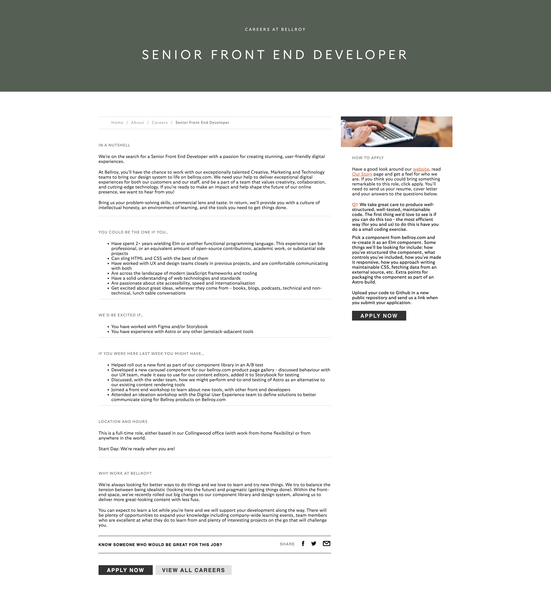

# Bellroy component with ELM and Astro

## Job offer

https://fr.bellroy.com/careers/senior-front-developer

## Specifications

-   Pick a component from bellroy.com and re-create it as an Elm component. -> src/elm/Card.elm
-   Some things we’ll be looking for include:
-   how you’ve structured the component, -> cf. repo
-   what controls you’ve included, -> Decoder of product props, Maybe Product to display something if the decoding fail
-   how you’ve made it responsive, -> The number of cards depends on the width
-   how you approach writing maintainable CSS, -> I usually use Tailwind
-   fetching data from an external source, etc. -> content collection of Astro
-   Extra points for packaging the component as part of an Astro build. -> +1 💪

## Time management

2h

-   Astro
-   Content collection
-   Tailwind
-   Elm setup

4h

-   Elm Card

1h

-   GitHub pages
